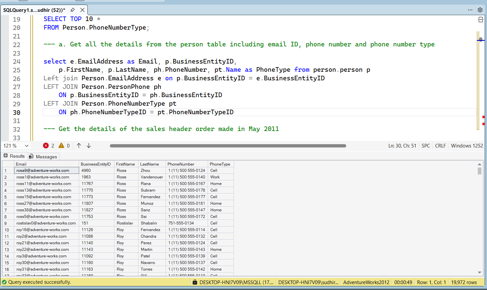
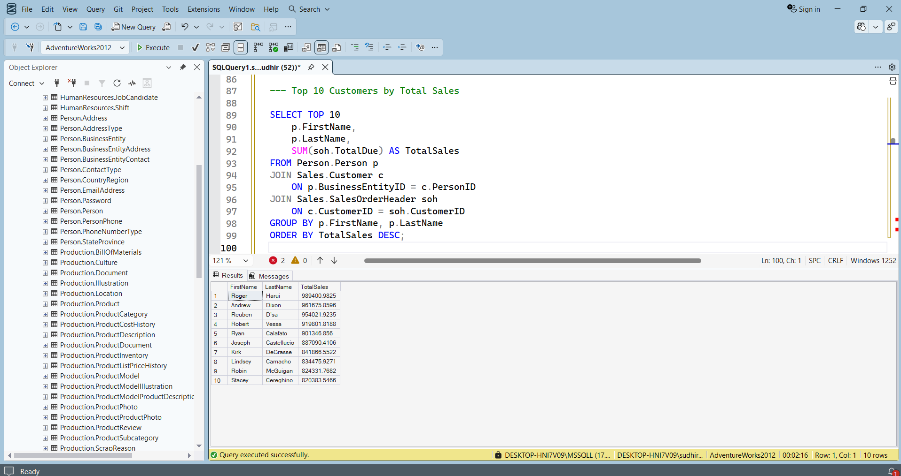
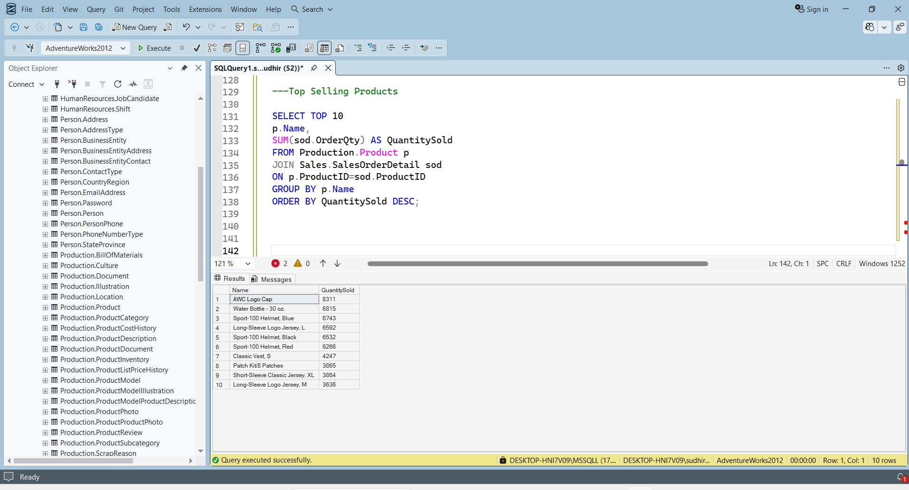
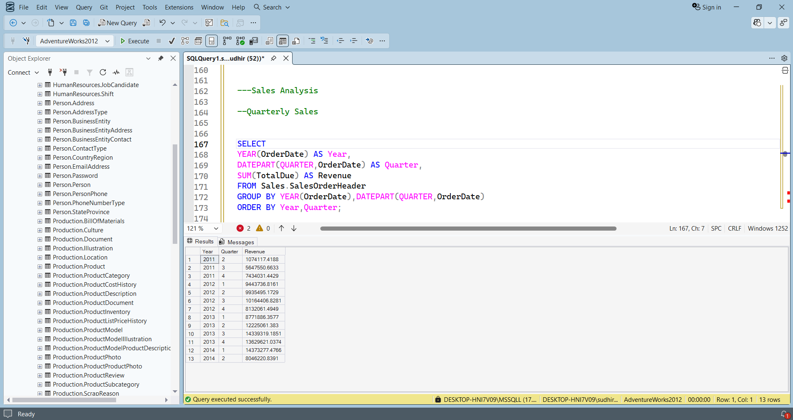
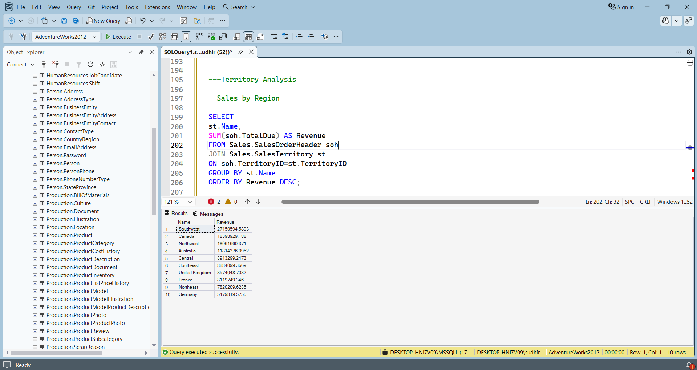
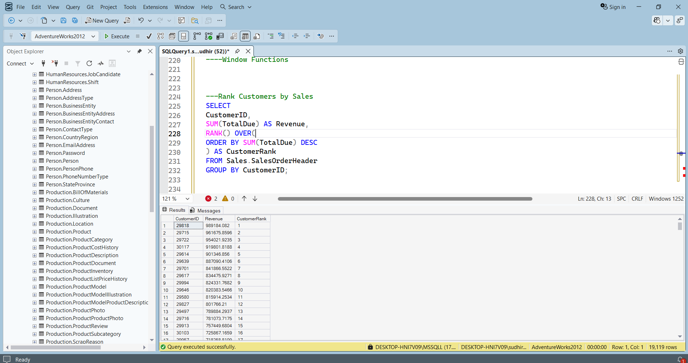
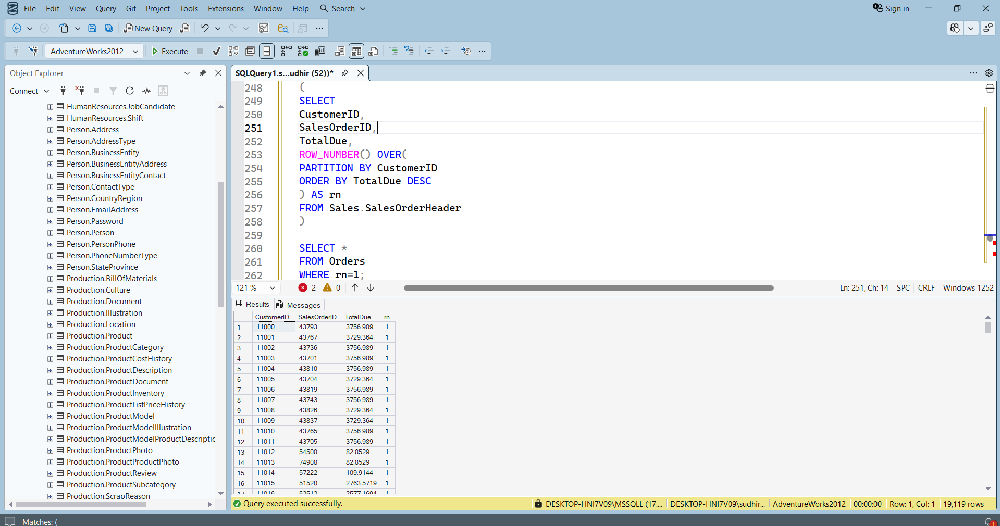
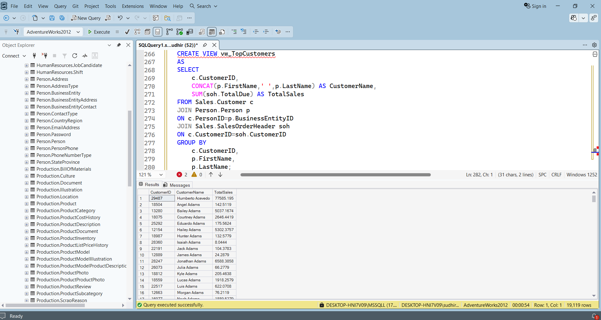
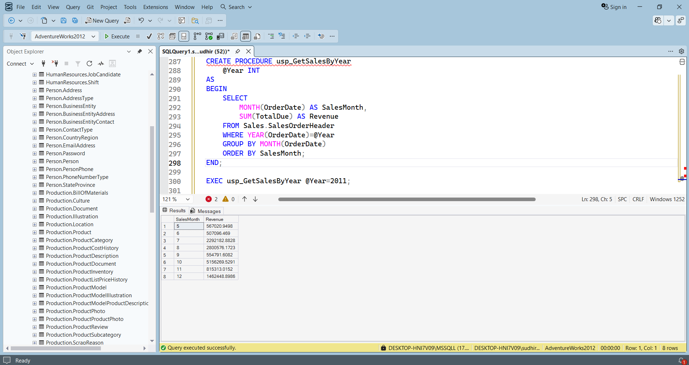

# 📊 AdventureWorks SQL Business Analysis
## 📖 Project Overview

This project showcases business analysis using the Microsoft AdventureWorks2012 database and SQL Server. It demonstrates SQL skills by solving real-world business problems through data retrieval, customer analysis, sales reporting, product performance analysis, regional analysis, window functions, Common Table Expressions (CTEs), SQL Views, and Stored Procedures.

The project is designed to simulate practical business reporting scenarios while demonstrating strong SQL fundamentals and analytical thinking.

## 🎯 Objectives

- Retrieve customer and sales information using SQL.
- Analyze top-performing customers and products.
- Evaluate quarterly and regional sales performance.
- Apply SQL joins to combine data across multiple tables.
- Demonstrate advanced SQL techniques including Window Functions and CTEs.
- Create reusable SQL Views and Stored Procedures.

- ## 🗄️ Database

**Database:** AdventureWorks2012

AdventureWorks2012 is Microsoft's sample transactional database containing sales, customers, products, territories, and order information. It provides a realistic business environment for practicing SQL and business analytics.

## 🛠️ Tools Used

| Category | Tool |
|----------|------|
| Database | Microsoft SQL Server |
| Language | T-SQL |
| IDE | SQL Server Management Studio (SSMS) |
| Dataset | AdventureWorks2012 |

## 💡 Skills Demonstrated

- SQL Data Retrieval
- Joins (INNER JOIN, LEFT JOIN)
- Data Aggregation (SUM, COUNT, AVG)
- GROUP BY & ORDER BY
- Date Functions
- Business Reporting
- Customer & Sales Analysis
- Product Performance Analysis
- Window Functions (RANK, ROW_NUMBER)
- Common Table Expressions (CTEs)
- SQL Views
- Stored Procedures

- ## 📈 Business Questions Solved

- Retrieve customer contact details with email and phone information.
- Identify the top 10 customers by total sales.
- Find the best-selling products based on quantity sold.
- Analyze quarterly sales revenue.
- Compare sales performance across regions.
- Rank customers based on total revenue.
- Retrieve the highest-value order for each customer.
- Identify high-revenue months using a Common Table Expression (CTE).
- Create reusable SQL Views for reporting.
- Build parameterized Stored Procedures for dynamic sales analysis.

- ## 🧠 SQL Concepts Used

| Category | Concepts |
|----------|----------|
| Data Retrieval | SELECT, WHERE |
| Joins | INNER JOIN, LEFT JOIN |
| Aggregation | SUM, COUNT, AVG |
| Grouping | GROUP BY |
| Sorting | ORDER BY |
| Date Functions | YEAR(), MONTH(), DATEPART() |
| Window Functions | RANK(), ROW_NUMBER() |
| Advanced SQL | Common Table Expressions (CTEs) |
| Database Objects | Views, Stored Procedures |

## 📸 Project Screenshots

### 1. Customer Contact Details

Retrieves customer information by combining person, email, and phone details using LEFT JOINs.

---

### 2. Top 10 Customers by Total Sales

Identifies the highest-value customers based on total sales revenue.

---

### 3. Top Selling Products

Analyzes products with the highest quantities sold.

---

### 4. Quarterly Sales Analysis

Summarizes revenue by year and quarter to identify sales trends.

---

### 5. Sales by Region

Compares total sales revenue across different sales territories.

---

### 6. Customer Sales Ranking

Ranks customers based on their total sales using the RANK() window function.

---

### 7. Top Order per Customer

Retrieves the highest-value order for each customer using ROW_NUMBER().

---

### 8. SQL View Creation

Creates a reusable SQL View for customer sales reporting.

---

### 9. Stored Procedure Execution

Demonstrates a parameterized stored procedure for dynamic yearly sales analysis.

## 📚 Key Learnings

Through this project, I gained hands-on experience in:

- Writing efficient SQL queries for business analysis.
- Combining data from multiple tables using SQL JOINs.
- Performing customer, product, sales, and regional analysis.
- Applying aggregate functions for business reporting.
- Using Window Functions (RANK, ROW_NUMBER) for advanced analysis.
- Creating Common Table Expressions (CTEs) for readable and reusable queries.
- Building SQL Views for reusable reporting.
- Developing parameterized Stored Procedures.
- Solving real-world business problems using SQL Server.

## 🚀 Future Improvements

- Add more advanced analytical SQL queries.
- Build interactive Power BI dashboards using the AdventureWorks database.
- Optimize queries for better performance.
- Create additional Views and Stored Procedures for business reporting.
- Expand the project with sales forecasting and customer segmentation.

  ## 👨‍💻 Author

**Sudhir Satapathy**

MBA (Finance & Marketing)

Aspiring Data Analyst

📧 Email: sudhir.itzme@gmail.com

🔗 LinkedIn: www.linkedin.com/in/sudhir-kumar-satapathy

💻 GitHub: https://github.com/sudhirintel

## ⭐ If you found this project useful

Please consider giving this repository a ⭐ on GitHub.
